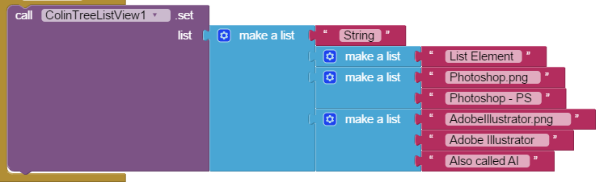
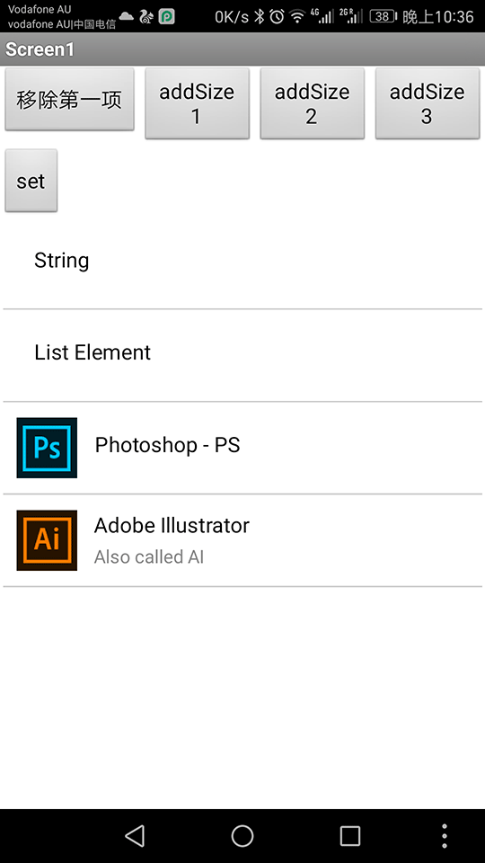

# ColinTreeListView

更高级的“列表显示框”，通过拓展组件动态实现！  

使用方法：  
1. 为该组件预留一个空的垂直布局（VerticalArrangement），将宽高设置好
2. 在添加列表项之前先初始化一下，调用传入一个参数：  
     
3. 设置列表的内容：  
   其中，列表（list）这个参数是一个二维的列表，列表项（将被转换为列表元素）可以为：  
   * 直接一个文本作为列表项，则为列表显示项的文本  
   * 一个列表，只有一个列表项，则这个列表项（文本）即为列表显示项的文本。显示效果与上一种相同  
   * 如果一个子列表有两个项，则依次对应：列表项图标路径 和 列表项文字  
   * 如果一个子列表有三个项，则依次对应：列表项图标路径、列表项主文字 和 列表项副文字  

   （各种列表项可以在一个列表显示框中共存，并按照各自的规则显示）  
   
   代码样例如图：  
     
   对应显示效果如图：  
     

其他操作：
* 追加列表项（追加即加在列表末尾）  
  参数：  
  * element: 规则与设置列表内容的列表项相同。但在此处不可以是直接对接一个文本  
    
* 追加空列表项（追加即加在末尾）  
    
* 删除某一项（图中为删除第一项）  
  参数：  
  * elementIndex: 列表元素的索引值（即第几个列表元素）  
    
* 重置某一项（恢复为组件内置默认状态）  
  参数：  
  * elementIndex: 列表元素的索引值（即第几个列表元素）  
    
* 设置某一项（对某一个列表项的单独操作）  
  参数：  
  * elementIndex: 列表元素的索引值（即第几个列表元素）  
  * element: 规则与设置列表内容的列表项相同。但在此处不可以是直接对接一个文本  
    
