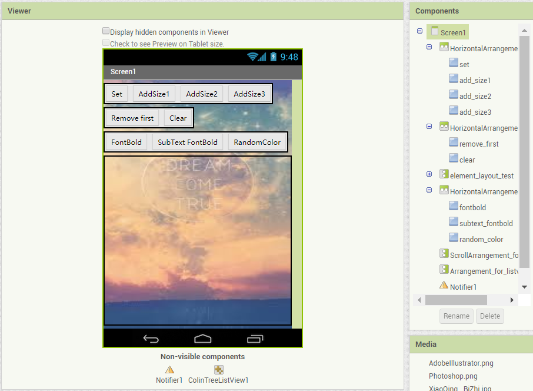
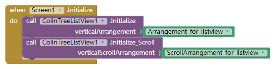
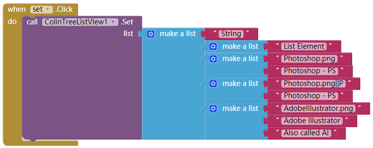
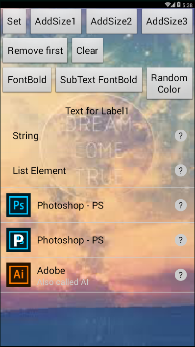
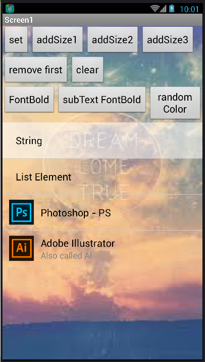
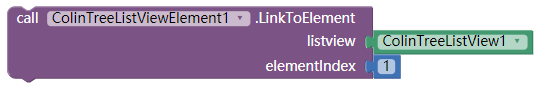

# Custom ListView - ColinTreeListView *

---

Higher level "ListView", using extensions!

* Update on 2018.7.27 (Version 10):
  * Added Get **by [@10MINT](https://github.com/10MINT)**
  * Added LastLongClickedElement **by [@10MINT](https://github.com/10MINT)**
  * Fixes label cannot click on some platforms

* Update on 2018.3.10 (Version 9):
  * Fixed Error of Visiblility
  * Added ClearCache(path) & ClearAllCache() -- still in test, it should works

* Update on 2018.3.4 (Version 8)
  * Fixed extraButtonEnabled not implemented
  * Added support of direct(static) functions in ColinTreeListViewElement

* Update on 2018.2.25 (Version 7) **THANK YOU [@User81](https://community.thunkable.com/u/User81) FOR SPONSORING**:
  * Fixed that lastClickedElement starts from 0
  * Fixed that images that cached by a same path would act wired when one of them is clicked
  * Added a extra button
  * Added property handler for every single element of the listview -> *[useage](#colintreelistviewelement)*  
    

* Update on 2018.2.11 (Version 6):
  * Added properties of text height (both main- & sub-text)

* Update on 2018.1.31 (Version 5):
  * Added icon text related properties
  * Added lastClickedElement & lastClickedIcon

* Update on 2017.12.30 (Version 4):
  * Adapted to all platforms (ai2.appinventor.mit.edu , thunkable , etc.) There should not more NoSuchMethodError at anywhere.

* Update on 2017.12.29 (version 3):
  * Adapted to new Appinventor (since 2017.12.27, Companion 2.45) (Fixed NoSuchMethodError)
  * Added properties related to image loading - AsyncImageLoad & CacheImage (that in a same path)
  * Added property - ScrollBottomAfterAdd

## How to use

1. Left a VerticalArrangement or a VerticalScrollArrangement, set the width and the height as you like.  
  Here is the sample:  
  

2. Before do anything like add a element, initialize it first:  
  Choose **only one** of the initialize method  
  

3. Set the list  
  The "set" method required a list, and the list elements can be: 

  * **Single text element without icon**:  
    The list element here is just a Text, and it will be shown in the element
  * **Single text element without icon**(same with the one above):  
    A sub-list with only one item is also allowed when creating a Single text element without icon.
  * **Single text element with icon**:  
    The sub-list with two item will be proceed as a Single text element with icon.  
    The first item is the icon path, when the second one is the text here.
  * **Double text element with icon**:  
    A list with at least three item, is being recognize as a Double text elemtnt with icon.
    And only the very first three items will be used as the parameters here.
    They are: icon(path), Main-text, and Sub-text

  **The three types of list element can exist when a ColinTreeListView is created**

  Sample code:  
    
  Runtime screenshot (IconMultiParams checked):  
  

## Events

* Element events:
  * ElementClick
    {"name":"ElementClick", "param":["elementIndex"], "componentName":"ColinTreeListView1"}
    * *related property: LastClickedIcon*
      {"name":"LastClickedIcon"}
  * ElementLongClick
    {"name":"ElementLongClick", "param":["elementIndex"]}
    * *related property: LastLongClickedElement*
      {"name":"LastLongClickedElement"}
  * ElementTouchDown
    {"name":"ElementTouchDown", "param":["elementIndex"]}
  * ElementTouchUp
    {"name":"ElementTouchUp", "param":["elementIndex"]}

* ExtraButton events:
  * ExtraButtonClick
    {"name":"ExtraButtonClick", "param":["elementIndex"]}
    * *related property: LastClickedExtraButton*
      {"name":"LastClickedExtraButton"}
  * ExtraButtonLongClick
    {"name":"ExtraButtonLongClick", "param":["elementIndex"]}
  * ExtraButtonTouchDown
    {"name":"ExtraButtonTouchDown", "param":["elementIndex"]}
  * ExtraButtonTouchUp
    {"name":"ExtraButtonTouchUp", "param":["elementIndex"]}

* Element icon events:
  * IconClick
    {"name":"IconClick", "param":["elementIndex"]}
    * *related property: LastClickedIcon*
      {"name":"LastClickedIcon"}
  * IconLongClick
    {"name":"IconLongClick", "param":["elementIndex"]}
  * IconTouchDown
    {"name":"IconTouchDown", "param":["elementIndex"]}
  * IconTouchUp
    {"name":"IconTouchUp", "param":["elementIndex"]}

## Methods

* List operations:
  * AddElement
    {"name":"AddElement", "param":["element"]}
  * AddEmptyElement
    {"name":"AddEmptyElement"}
  * Clear
    {"name":"Clear"}
  * Get
    {"name":"Get", "output":true}
  * GetElement
    {"name":"GetElement", "param":["elementIndex"], "output":true}
  * Initialize
    {"name":"Initialize", "param":["verticalArrangement"]}
  * Initialize_Scroll (using the VerticalScrollArrangement)
    {"name":"Initialize_Scroll", "param":["verticalScrollArrangement"]}
  * RemoveElement
    {"name":"RemoveElement", "param":["elementIndex"]}
  * Set
    {"name":"Set", "param":["list"]}

* Element operations:
  * SetElement
    {"name":"SetElement", "param":["elementIndex", "element"]}
  * SetElementIcon
    {"name":"SetElementIcon", "param":["elementIndex", "path"]}
  * SetElementMainText
    {"name":"SetElementMainText", "param":["elementIndex", "mainText"]}
  * SetElementSubText
    {"name":"SetElementSubText", "param":["elementIndex", "subText"]}
  * SetElementText
    {"name":"SetElementText", "param":["elementIndex", "text"]}

* Other operations:
  * ClearAllCache
    {"name":"ClearAllCache"}
  * ClearCache
    {"name":"ClearCache", "param":["path"]}

## Properties

ColinTreeListView provide the real-time list layout modifing through properties  
And the properties are: (the order of the properties cannot be control by code, sorry for the mess here)  

* AsyncImageLoad - load image in a asynchronous way
  {"name":"AsyncImageLoad"}
  {"name":"AsyncImageLoad", "getter":false}
* CacheImage - cache image by file path, in order to avoid wasting time and memory
  {"name":"CacheImage"}
  {"name":"CacheImage", "getter":false}
* ElementHeight - Height of elements
  {"name":"ElementHeight"}
  {"name":"ElementHeight", "getter":false}
* ExtraButtonBgColor
  {"name":"ExtraButtonBgColor"}
  {"name":"ExtraButtonBgColor", "getter":false}
* ExtraButtonEnabled - default as false, if you need a extra button, please check it (set it to true).
  {"name":"ExtraButtonEnabled"}
  {"name":"ExtraButtonEnabled", "getter":false}
* ExtraButtonHeight
  {"name":"ExtraButtonHeight"}
  {"name":"ExtraButtonHeight", "getter":false}
* ExtraButtonImage
  {"name":"ExtraButtonImage"}
  {"name":"ExtraButtonImage", "getter":false}
* ExtraButtonPaddings
  {"name":"ExtraButtonPaddings"}
  {"name":"ExtraButtonPaddings", "getter":false}
* ExtraButtonShape
  {"name":"ExtraButtonShape"}
  {"name":"ExtraButtonShape", "getter":false}
* ExtraButtonText - I would not support seting text of extra button of each elements :P
  {"name":"ExtraButtonText"}
  {"name":"ExtraButtonText", "getter":false}
* ExtraButtonTextFontBold
  {"name":"ExtraButtonTextFontBold"}
  {"name":"ExtraButtonTextFontBold", "getter":false}
* ExtraButtonTextFontSize
  {"name":"ExtraButtonTextFontSize"}
  {"name":"ExtraButtonTextFontSize", "getter":false}
* ExtraButtonWidth  
  {"name":"ExtraButtonWidth"}
  {"name":"ExtraButtonWidth", "getter":false}
* IconBgColor
  {"name":"IconBgColor"}
  {"name":"IconBgColor", "getter":false}
* IconHeight
  {"name":"IconHeight"}
  {"name":"IconHeight", "getter":false}
* IconMultiParams - if this is checked, new format (introduced since Version 5) `path||iconText` would be available. Value like `Photoshop.png||P` will be displayed as a Text `P` on image `Photoshop.png`
  {"name":"IconMultiParams"}
  {"name":"IconMultiParams", "getter":false}
* IconPaddings - for larger space of text displaying
  {"name":"IconPaddings"}
  {"name":"IconPaddings", "getter":false}
* IconShape - same as one of buttons
  {"name":"IconShape"}
  {"name":"IconShape", "getter":false}
* IconTextColor
  {"name":"IconTextColor"}
  {"name":"IconTextColor", "getter":false}
* IconTextFontBold
  {"name":"IconTextFontBold"}
  {"name":"IconTextFontBold", "getter":false}
* IconTextFontSize
  {"name":"IconTextFontSize"}
  {"name":"IconTextFontSize", "getter":false}
* IconWidth  
  {"name":"IconWidth"}
  {"name":"IconWidth", "getter":false}
* ScrollBottomAfterAdd - Scroll to bottom after an element is added - (using delay to make sure listview has been re-rendered)
  {"name":"ScrollBottomAfterAdd"}
  {"name":"ScrollBottomAfterAdd", "getter":false}
* SubTextColor
  {"name":"SubTextColor"}
  {"name":"SubTextColor", "getter":false}
* SubTextFontBold
  {"name":"SubTextFontBold"}
  {"name":"SubTextFontBold", "getter":false}
* SubTextFontSize
  {"name":"SubTextFontSize"}
  {"name":"SubTextFontSize", "getter":false}
* SubTextHeight (-1 for auto, -2 for fill parent)
  {"name":"SubTextHeight"}
  {"name":"SubTextHeight", "getter":false}
* TextColor
  {"name":"TextColor"}
  {"name":"TextColor", "getter":false}
* TextFontBold
  {"name":"TextFontBold"}
  {"name":"TextFontBold", "getter":false}
* TextFontSize
  {"name":"TextFontSize"}
  {"name":"TextFontSize", "getter":false}
* TextHeight (-1 for auto, -2 for fill parent)  
  {"name":"TextHeight"}
  {"name":"TextHeight", "getter":false}
* TouchDownColor - Color when element is touch down, default alpha is 136/255, about 53%
  {"name":"TouchDownColor"}
  {"name":"TouchDownColor", "getter":false}
* UnderlineColor - An underline is the line between two elements
  {"name":"UnderlineColor"}
  {"name":"UnderlineColor", "getter":false}
* UnderlineWidth
  {"name":"UnderlineWidth"}
  {"name":"UnderlineWidth", "getter":false}
* WidthAfterIcon
  {"name":"WidthAfterIcon"}
  {"name":"WidthAfterIcon", "getter":false}
* WidthBeforeExtraButton
  {"name":"WidthBeforeExtraButton"}
  {"name":"WidthBeforeExtraButton", "getter":false}
* WidthBeforeIcon  
  {"name":"WidthBeforeIcon"}
  {"name":"WidthBeforeIcon", "getter":false}

**Attached: the color when element is touch down**  

## ColinTreeListViewElement

This is a handler for every single element in the listView.

**Note: Before use any property, please link to a element by calling `LinkToElement`**  

Properties that not exist in ListView:

* UseGlobalProperties - default as False, if you want the properties of this element not to be refresh when the ListView properties changed, please set this to True.
  {"name":"UseGlobalProperties", "componentName":"ColinTreeListViewElement1"}
  {"name":"UseGlobalProperties", "getter":false}
* ElementBackgroundColor
  {"name":"ElementBackgroundColor"}
  {"name":"ElementBackgroundColor", "getter":false}

## Download  

* Last update 2018.7.27 (v10)
* <a href="/aix/cn.colintree.aix.ColinTreeListView.aix" target="_blank">Mirror 1 (This website)</a>
* [Mirror 2 (Github release)](https://github.com/OpenSourceAIX/ColinTreeListView/releases)
* [Source Code](https://github.com/OpenSourceAIX/ColinTreeListView)

## [Need more features?](ListViewCustomize.md)