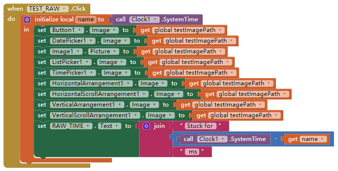

# Asynchronous Image Loader - AsyncImageLoader

---

Do not need to get stuck while loading online image! 

### Events and Methods

* Events
  * ImageLoadFailed
  * ImageLoaded (Succeed)

  

* Methods
  * SetArrangementImage  
    (TableArrangement has not a Image property, so it is not supported)
  * SetButtonBaseImage  
    (Button, DatePicker, ListPicker, and TimePicker are supproted)
  * SetImagePicture  
    (For Image only)

  (Totally 9 components supported)
  P.S. these methods can set up the image, but the image property will not be changed  
  e.g. i used this extension to set a online picture for a empty Image comopnent, but the property Image.Picture is still empty though the component has already get a picture.

  

### Download

* Last update 2017.9.24
* <a href="/aix/cn.colintree.aix.AsyncImageLoader.aix" target="_blank">Mirror 1 (This website)</a>

### Sample

* [Sample aia](https://github.com/ColinTree/aix_colintree_cn/releases/download/AsyncImageLoaderTest/AsyncImageLoaderTest_en.aia)   
* [Sample apk](https://github.com/ColinTree/aix_colintree_cn/releases/download/AsyncImageLoaderTest/AsyncImageLoaderTest_en.apk) 

while the app is running in a same network environment, the result has a large difference  

* Using component propertes make the screen stop responsing for a while, until all the images are loaded (1.3 second stucking in screenshot)  
  
* Using extension to set up the images, it just takes about 0.58 second to load, and not getting stuck  
  