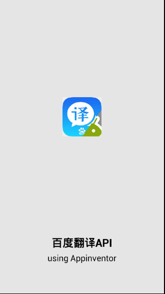

# Baidu Translate (API) - BaiduFanyi

---

**Using this extension to get the translate result from Baidu Translate API**  
(Actually this is for the people that cannot access Google in China XD)

[Home page of Baidu Translate API](http://fanyi-api.baidu.com/api/trans/product/desktop?req=developer)

### Download
* Last update 2017.8.5
* <a href="/aix/cn.colintree.aix.Translators.BaiduFanyi.aix" target="_blank">Mirror 1 (This website)</a>
* [Sample aia](https://github.com/ColinTree/aix_colintree_cn/releases/download/BaiduFanyiTest/BaiduFanyiTest.aia)  
* [Sample apk](https://github.com/ColinTree/aix_colintree_cn/releases/download/BaiduFanyiTest/BaiduFanyiTest.apk)  
   
