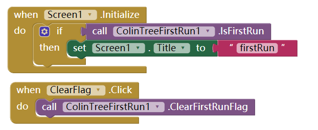

# Check first run - ColinTreeFirstRun *

---

Check if the code is the first time to run!

## Methods

* ClearFirstRunFlag - Call this will make next `IsFirstRun` returns `true`
  {"name":"ClearFirstRunFlag", "componentName":"ColinTreeFirstRun1"}
* IsFirstRun
  {"name":"IsFirstRun", "output":true}

## How to use

## Download

* Last update 2017.8.17
* <a href="/aix/cn.colintree.aix.ColinTreeFirstRun.aix" target="_blank">Mirror 1 (This website)</a>
* [Mirror 2](https://raw.githubusercontent.com/OpenSourceAIX/ColinTreeFirstRun/master/cn.colintree.aix.ColinTreeFirstRun.aix)
* [Source](https://github.com/OpenSourceAIX/ColinTreeFirstRun)