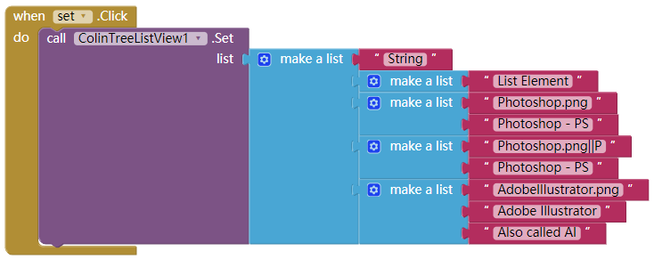
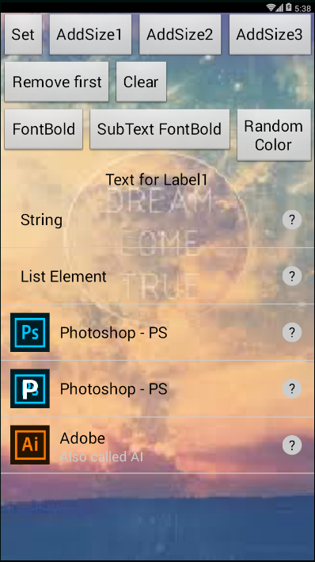
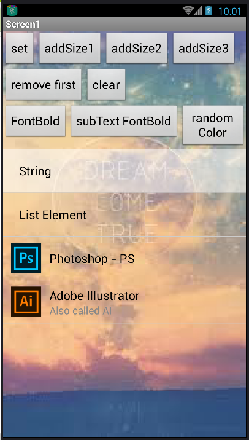
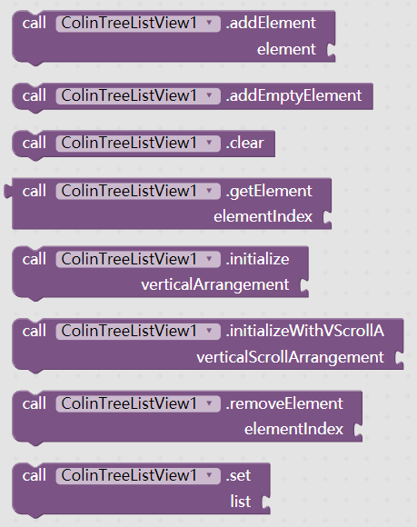

# Custom ListView - ColinTreeListView

---

Higher level "ListView", using extensions!

### How to use

1. Left a VerticalArrangement or a VerticalScrollArrangement, set the width and the height as you like  
   Example:  
   

2. Before do anything like add a element, initialize it first:  
   Choose **only one** of the initialize method  
   

3. Set the list  
   The "set" method required a list, and the list elements can be: 

  * **Single text element without icon**:  
    The list element here is just a Text, and it will be shown in the element

  * **Single text element without icon**(same with the one above):  
    A sub-list with only one item is also allowed when creating a Single text element without icon.

  * **Single text element with icon**:  
    The sub-list with two item will be proceed as a Single text element with icon.  
    The first item is the icon path, when the second one is the text here.

  * **Double text element with icon**:  
    A list with at least three item, is being recognize as a Double text elemtnt with icon.
    And only the very first three items will be used as the parameters here.
    They are: icon(path), Main-text, and Sub-text

    **The three types of list element can exist when a ColinTreeListView is created**

  Sample code:  
    
  Runtime screenshot:  
  

### Component properties

ColinTreeListView provide the real-time list layout modifing through properties  
And the properties are: (the order of the properties cannot be control by code, sorry for the mess here)  

* Height of elements - ElementHeight
* Height & Width of icons - IconHeight & IconWidth
* Sub-text color & bold & font size - SubTextColor & SubTextBold & SubTextSize  
    

* Text(including Main-text) color & bold & font size - TextColor & TextBold & TextSize
* Color when element is touch down, default alpha is 136/255, about 53% - TouchDownColor
* Color and the line width of the element underline(dividing line) - UnderlineColor & UnderlineWidth
* the gap that after & before the icon - WidthAfterIcon & WidthBeforeIcon  
  

** Attached: the color when element is touch down **  

### All the events and methods

* Element events:
  * ElementClick
  * ElementLongClick
  * ElementTouchDown
  * ElementTouchUp

  

* Element icon events:
  * IconClick
  * IconLongClick
  * IconTouchDown
  * IconTouchUp
  
  

* List operating:
  * addElement
  * addEmptyElement
  * clear
  * getElement
  * initialize
  * initializeWithVScrollA (using the VerticalScrollArrangement)
  * removeElement
  * set
  * ** parameters:  **
    * element - the content of the element
    * elementIndex - the serial number of the element, starts from 1

  

* Element operating:
  * setElement
  * setElementIcon
  * setElementMainText
  * setElementSubText
  * setElementText
  * ** parameters:  **
    * element - the content of the element
    * elementIndex - the serial number of the element, starts from 1

  

### Download  
  Release later, sorry~