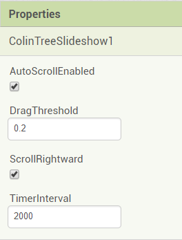
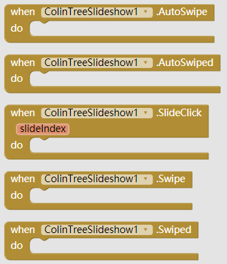
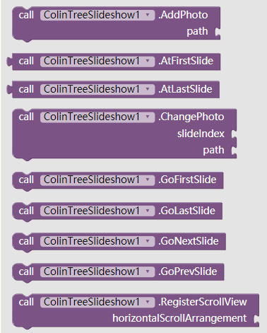

# SlideShow (Carousel) - ColinTreeSlideShow

---

Using one extension component to finish this job!  
**[2017.9.24 Update available](#Update%20log) now asynchronous loading supported, no getting stuck any more**

### How to use

1. Left a HorizontalScrollArrangement, set the width and the height as you like  
   (there is a known bug that when the arrangement's size changed, the slides are still that size, it causes problems)  

   Example: (The BG Color can be set here)  
   

2. Register the horizontalScrollArrangement:  
   

3. Add photos:  
   

### Compopnent properties

* AutoScrollEnabled
* DragThreshold  
  **Explanation**:  
  The value is from 0~1, same as 0%~100%, default as 0.2  
  After user drag the slides, when the displacement is larger the threshold value (Width * DragThreshold), ColinTreeSlideShow will scroll to the intent slide automatically  

  **Example**:  
  The arrangement of the slideshow is 300px, DragThreshold is 0.2. After user drag the slides rightward for 70px, as 70 > 300*0.2=60, the slideshow would scroll to the previous slide
* ScrollRightward  
  (auto-Scroll rightward when checked, leftward when not checked)  
* TimerInterval (Unit: millisecond, 1s=1000ms)
  Control when the slideshow should auto-Scroll  
  
  

* ImageWhileLoading (added in v2)

  

### All the events and methods

* Events:
  * AutoSwipe (before scroll finished)
  * AutoSwiped (after scroll finished)
  * SlideClick
  * Swipe (before scroll finished)
  * Swiped (after scroll finished)

  

  * ImageLoaded (added in v2)
  * ImageLoadFailed (added in v2)

  

* Methods:
  * AddPhoto
  * AtFirstSlide
  * AtLastSlide
  * ChangePhoto
  * GoFirstSlide
  * GoLastSlide
  * GoNextSlide
  * GoPrevSlide
  * RegisterScrollView
  * ** Parameters **
    * slideIndex - index of slides(photos), start from 1
    * path - the image path

  

### Special property

A property that is not on design page
* CurrentSlide

  

### Download
* Last update 2017.9.24 (v2)
* <a href="/aix/cn.colintree.aix.ColinTreeSlideshow.aix" target="_blank">Mirror 1 (This website)</a>
* [Sample aia](https://github.com/ColinTree/aix_colintree_cn/releases/download/ColinTreeSlideShow_v2/ColinTreeSlideshowTest.aia)  
* [Sample apk](https://github.com/ColinTree/aix_colintree_cn/releases/download/ColinTreeSlideShow_v2/ColinTreeSlideshowTest_appinventor.apk) - Appinventor  
* [Sample apk](https://github.com/ColinTree/aix_colintree_cn/releases/download/ColinTreeSlideShow_v2/ColinTreeSlideshowTest_thunkable.apk) - Thunkable  

### Update log

* Version 2 (2017.9.24)  
  Merged [AsyncImageLoader](AsyncImageLoader)  
  No more stucking when load online image  
  [GitHub Release](https://github.com/ColinTree/aix_colintree_cn/releases/tag/ColinTreeSlideShow_v2)

* Version 1 (2017.9.17)  
  [GitHub Release](https://github.com/ColinTree/aix_colintree_cn/releases/tag/ColinTreeSlideShow)