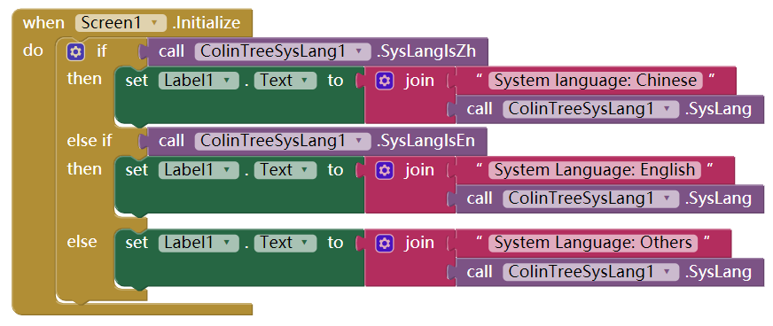
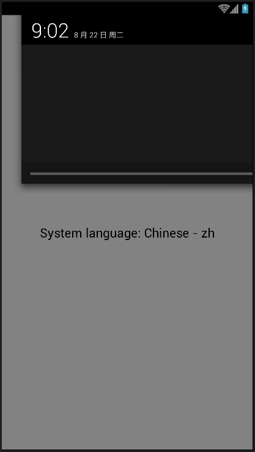

# Get system language - ColinTreeSysLang *

---

Included three procedure：
* Get system language code (e.g. en)
* Check if is English
* Check if is Chinese
(if need other language checking, just {{ book.lang.ContactMe }})

### {{ book.lang.Sample }}
With the test code:   

The result in different language environment got the result: (use the date to reconize the system language)  
 

### {{ book.lang.Download }}
* {{ book.lang.LastUpdate }} 2017.8.17
* <a href="/aix/cn.colintree.aix.ColinTreeSysLang.aix" target="_blank">{{ book.lang.Mirror1 }}</a>
* [{{ book.lang.Mirror2 }}](https://raw.githubusercontent.com/OpenSourceAIX/ColinTreeSysLang/master/cn.colintree.aix.ColinTreeSysLang.aix)
* [{{ book.lang.Source }}](https://github.com/OpenSourceAIX/ColinTreeSysLang)