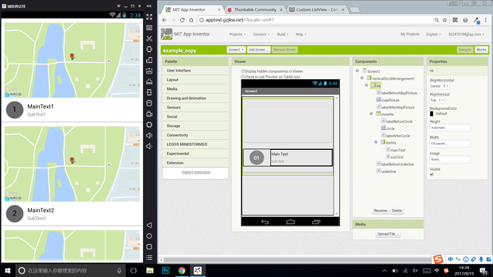

# ListView advance customize

[<small>Original post</small>](https://community.thunkable.com/t/advance-customize-your-listview-by-colintree/7828)

Hello everyone, i m ColinTree

Are you still remember my [ColinTreeListView](ColinTreeListView.md)?

these days i wanna start a new meaningful thing to do:

**I CAN MAKE THE CUSTOMIZED LISTVIEW THAT YOU WANT AS YOU LIKE!**

## Want You Can Order

for the component, you can customize:

* properties
* component name
* component icon (16x16 as ai/tk required)

for each list element, it can contains at most:

* 30 components (including layouts)
* touching events (click, longclick, touch down & touch up , ect. )
* parameters

P.S. if it is too complex i may refuse to do it or need a additional fee~  
(like asking me to make a copy of facebook's listview)

## Fee

$15 for each (+$15 if need me to design the AIA for you) (Alipay, Wechat, QQ or Paypal allowed)

## Codes

The only copy of my work will given to you, you and me are the only ones that get the extension  
Please respect my work, i allow any decompile that is for non-commercial use (posting app to app-stores allowed)

## Example

* one of my friends sent me the AIA file, with the element structure like shown in the picture
* i built it for him. after finished, i will send the extension to him
* it runs successfully, like in the screenshot

## Contact me

* QQ: 502470184
* E-mail: 502470184@qq.com
* Thunkable community: [ColinTree](https://community.thunkable.com/u/ColinTree)