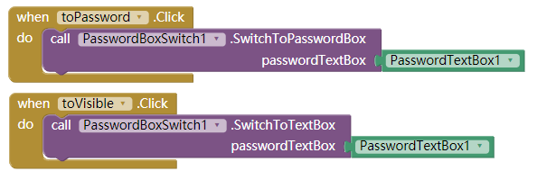
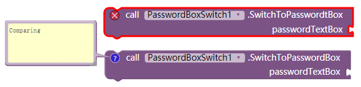

# Password visibility - PasswordBoxSwitch

---

Chase the fashion of design, avoid creating two PasswordTextBox~
(nowaday there are more and more sign-up pages get only one password textbox, but with a switch of password visibility. REDUCE USER TIME COSTS)

### Sample

That is all:  

> I made a small update at about 2017.9.27 21:55 (GMT+8)  
> If you upgrade it from a old version, the block "SwitchToPassword**t**Box" will comes an error like in the picture. instead, we get "SwitchToPasswordBox"  
> 

### Download

* Last update 2017.9.27
* <a href="/aix/cn.colintree.aix.PasswordBoxSwitch.aix" target="_blank">Mirror 1 (This website)</a>
