# Scroll Arrangement Handlers (v2+)

---

This extension package included two extensions. Horizontal Scroll Arrangement Handler(HorizontalScrollHandler) AND Vertical Scroll Arrangement Handler(VerticalScrollHandler).

Update on 2017.9.29 (Version 2)  
* Fixed problem that names of methods & events not match the standard. (Extension renamed to avoid confusing)
* Component icons added
* FadingEdgeEnabled (Property)
* OverScrollMode (Property)
* ScrollBarEnabled (Property)
* UserControl (Property)
* MaxScrollPosition (Property)
* ScrollPosition (Property)

Update on 2017.8.26:
* added TouchUp (Event)

## Horizontal Scroll Arrangement Handler (HorizontalScrollHandler)

* Events
  * ReachLeftEnd
  * ReachRightEnd
  * ScrollChanged
  * TouchUp

  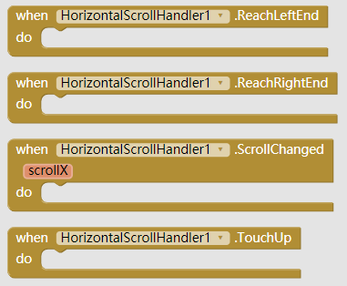

* Method
  * ArrowScrollLeftward (half-width)
  * ArrowScrollRightward (half-width)
  * PageScrollLeftward (full-width)
  * PageScrollRightward (full-width)
  * RegisterScrollView
  * ScrollBy
  * ScrollLeftEnd
  * ScrollRightEnd
  * ScrollTo
  * SmoothScrollBy
  * SmoothScrollTo
  * ** parameters: **
    * px - the displacement of scrolling. positive if scrolling rightward, and negative if scrolling leftward

  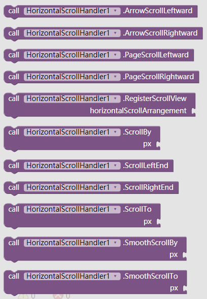

* Properties
  * FadingEdgeEnabled  

    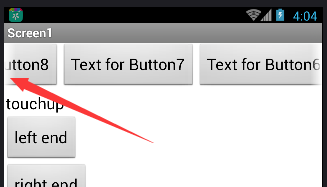

  * OverScrollMode
    * 0 - Always allow a user to over-scroll this view, provided it is a view that can scroll.
    * 1 (default) - Allow a user to over-scroll this view only if the content is large enough to meaningfully scroll, provided it is a view that can scroll.
    * 2 - Never allow a user to over-scroll this view.
    * **(This may looks different in different version of system)**  
    
    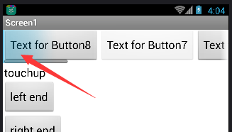

  * ScrollBarEnabled

    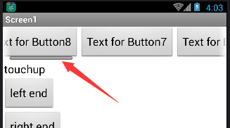

  * UserControl
    * Allow user to drag the scroll arrangement (or not)

  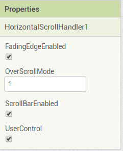  

  * MaxScrollPosition
  * ScrollPosition
  
  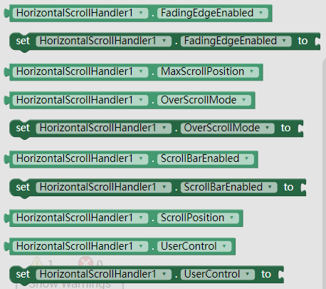

## Vertical Scroll Arrangement Handler (VerticalScrollHandler)

* Events
  * ReachBottom
  * ReachTop
  * ScrollChanged
  * TouchUp

  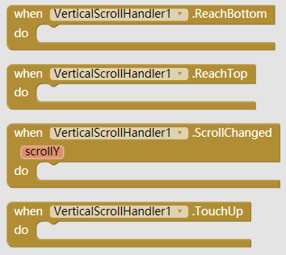

* Method
  * ArrowScrollDownward
  * ArrowScrollUpward
  * PageScrollDownward
  * PageScrollUpward
  * RegisterScrollView
  * ScrollBottom
  * ScrollBy
  * ScrollTo
  * ScrollTop
  * SmoothScrollBy
  * SmoothScrollTo
  * ** parameters: **
    * px - the displacement of scrolling. positive if scrolling downward, and negative if scrolling upward

  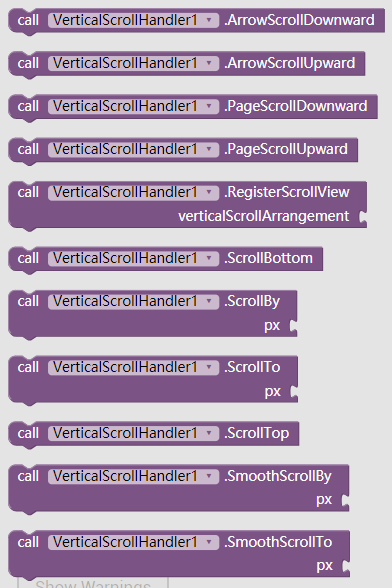

* Properties
  * FadingEdgeEnabled  

    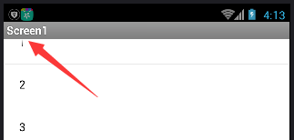

  * OverScrollMode
    * 0 - Always allow a user to over-scroll this view, provided it is a view that can scroll.
    * 1 (default) - Allow a user to over-scroll this view only if the content is large enough to meaningfully scroll, provided it is a view that can scroll.
    * 2 - Never allow a user to over-scroll this view.
    * **(This may looks different in different version of system)**  
    
    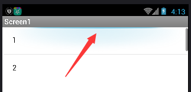

  * ScrollBarEnabled

    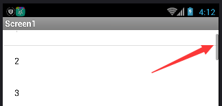
    
  * UserControl
    * Allow user to drag the scroll arrangement (or not)

  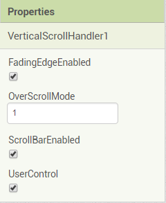  

  * MaxScrollPosition
  * ScrollPosition
  
  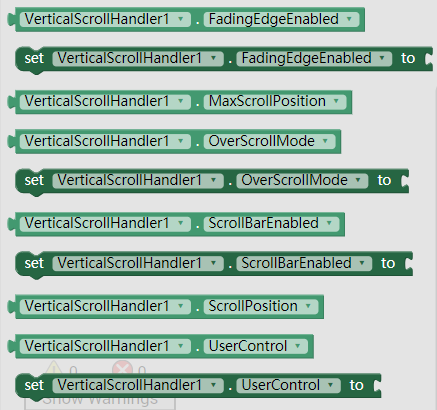

### Download
* Last update 2017.9.19 (v2)
* <a href="/aix/cn.colintree.aix.ScrollArrangementHandlers.aix" target="_blank">Mirror 1 (This website)</a>