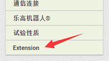
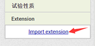
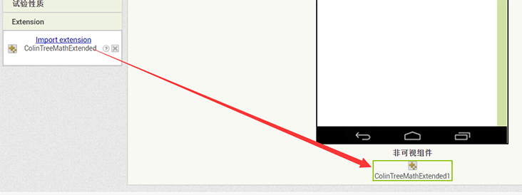

# How to Install Extensions

---

First get(download) the .aix file  
if the file you downloaded is not .aix, try:
1. shouble click the file, open it as zip, maybe the aix is inside  
1. If you download the file with Internet-Explorer or Edge, try Chrome instead  
1. Does not work? [Contact me](mailto:502470184@qq.com)

.aix files need to upload to appinventor or thunkable as a single file, so unzip is not required

Then go to Appinventor (it is almost the same with thunkable)  
opend your project  
find Extension category  
click and expand the list  

click import extenion  

on the poped window, click choose file and then OK  

After these, extension(s) are just like a normal Component and canbe used!  
