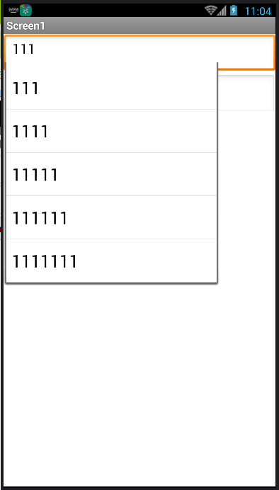

# AutoComplete plugin - AutoCompleteBox

---

AutoComplete, make your TextBox more clever!

* Update on 2018.1.4 (version 2):
  * Added Event: AfterSelect

## Designer Property

* Check if you are using Appinventor (affects the style) - ForAppinventor

  

## Event

* AfterSelect
  {"name":"AfterSelect", "componentName":"AutoCompleteBox1", "param":["textbox","selection"]}

## Methods

* GetCompletion
  {"name":"GetCompletion", "param":["textbox"], "output": true}
* SetCompletion
  {"name":"SetCompletion", "param":["textbox","list"]}

## Sample

## Download

* Last update 2018.1.4
* <a href="/aix/cn.colintree.aix.AutoCompleteBox.aix" target="_blank">Mirror 1 (This website)</a>
