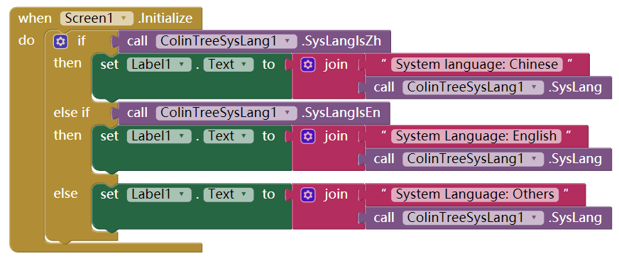
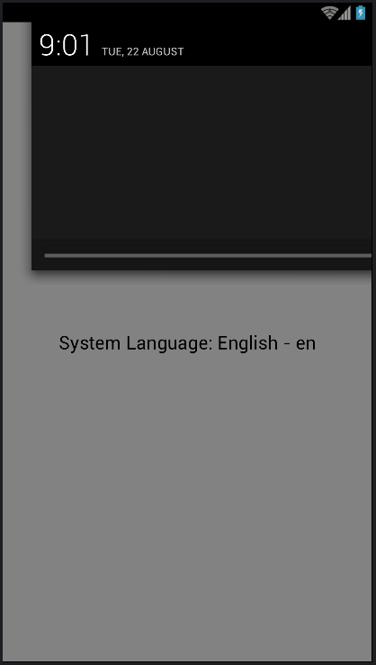

# Get system language - ColinTreeSysLang *

---

## Methods

* Get system language code (e.g. en)
  {"name":"SysLang", "output":true}
* Check if is English
  {"name":"SysLangEn", "output":true}
* Check if is Chinese
  {"name":"SysLangZh", "output":true}

(if need other language checking, just [Contact me](mailto:502470184@qq.com))

## Sample

With the test code:   

The result in different language environment got the result: (use the date to reconize the system language)  
 

## Download

* Last update 2017.8.17
* <a href="/aix/cn.colintree.aix.ColinTreeSysLang.aix" target="_blank">Mirror 1 (This website)</a>
* [Mirror 2](https://raw.githubusercontent.com/OpenSourceAIX/ColinTreeSysLang/master/cn.colintree.aix.ColinTreeSysLang.aix)
* [Source](https://github.com/OpenSourceAIX/ColinTreeSysLang)