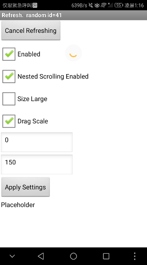
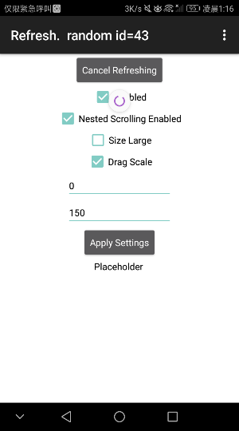

# SwipeRefresh

---

Swipe it, and refresh it.

## Event

* Refresh
  {"name":"Refresh", "componentName":"SwipeRefresh1"}

## Methods

* CancelRefreshing
  {"name":"CancelRefreshing"}
* RegisterArrangement
  {"name":"RegisterArrangement", "param":["arrangement"]}
* RegisterListView
  {"name":"RegisterListView", "param":["listView"]}

  P.S. Choose only one register method for each SwipeRefresh component. Once an arrangement(or a listview) is successfully registered to a SwipeRefresh compoent, any other register called will be ignored.

* Recommended Colors, by Material Design

  {"name":"_Color_holo_blue_bright ", "output":true}
  {"name":"_Color_holo_blue_dark ", "output":true}
  {"name":"_Color_holo_blue_light ", "output":true}
  {"name":"_Color_holo_green_dark ", "output":true}
  {"name":"_Color_holo_green_light ", "output":true}
  {"name":"_Color_holo_orange_dark ", "output":true}
  {"name":"_Color_holo_orange_light ", "output":true}
  {"name":"_Color_holo_purple ", "output":true}
  {"name":"_Color_holo_red_dark ", "output":true}
  {"name":"_Color_holo_red_light ", "output":true}

## Properties

* BackgroundColor - color of the process spinner
  {"name":"BackgroundColor"}
  {"name":"BackgroundColor", "getter":false}
* ColorList - for the refreshing animation, with a order of displaying.
  {"name":"ColorList"}
  {"name":"ColorList", "getter":false}
* DragEnd - The offset in pixels from the top of this view at which the progress spinner should come to rest after a successful swipe gesture.
  {"name":"DragEnd"}
  {"name":"DragEnd", "getter":false}
* DragScale - Setting it to true will cause indicator to be scaled up rather than clipped.
  {"name":"DragScale"}
  {"name":"DragScale", "getter":false}
* DragStart - The offset in pixels from the top of this view at which the progress spinner should appear.
  {"name":"DragStart"}
  {"name":"DragStart", "getter":false}
* Enabled
  {"name":"Enabled"}
  {"name":"Enabled", "getter":false}
* NestedScrollingEnabled
  {"name":"NestedScrollingEnabled"}
  {"name":"NestedScrollingEnabled", "getter":false}
* Refreshing
  {"name":"Refreshing"}
  {"name":"Refreshing", "getter":false}
* SizeLarge
  {"name":"SizeLarge"}
  {"name":"SizeLarge", "getter":false}

## Download

* Last update 2018.7.28 (v2)
* <a href="/aix/cn.colintree.aix.SwipeRefresh.aix" target="_blank">Mirror 1 (This website)</a>
* [Mirror 2 (Github release)](https://github.com/OpenSourceAIX/SwipeRefresh/releases)
* [Source Code](https://github.com/OpenSourceAIX/SwipeRefresh)

## Sample

* [Sample aia](https://github.com/ColinTree/aix_colintree_cn/releases/download/SwipeRefreshTest/SwipeRefreshTest_en.aia)   
* [Sample apk](https://github.com/ColinTree/aix_colintree_cn/releases/download/SwipeRefreshTest/SwipeRefreshTest_en_appinventor.apk) by AppInventor  
* [Sample apk](https://github.com/ColinTree/aix_colintree_cn/releases/download/SwipeRefreshTest/SwipeRefreshTest_en_thunkable.apk) by Thunkable  

