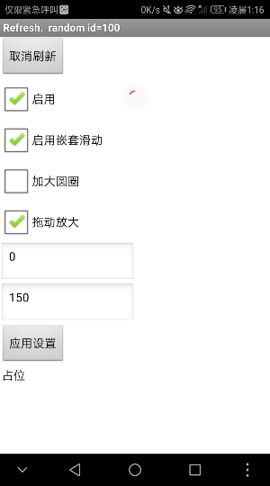

# 下拉刷新 - SwipeRefresh

---

下拉，刷新，如此简单。

## 事件

* 下拉刷新被触发
  {"name":"Refresh", "componentName":"SwipeRefresh1"}

## 方法

* 取消刷新
  {"name":"CancelRefreshing"}
* 将下拉刷新注册到布局（仅限滚动布局）
  {"name":"RegisterArrangement", "param":["arrangement"]}
* 讲下拉刷新注册到列表
  {"name":"RegisterListView", "param":["listView"]}

  P.S. 对于任何一个下拉刷新组件，在两个注册方法中，只选择一个。一旦注册成功，之后调用的注册方法都会被无视。

* Material Design所推荐使用的颜色

  {"name":"_Color_holo_blue_bright ", "output":true}
  {"name":"_Color_holo_blue_dark ", "output":true}
  {"name":"_Color_holo_blue_light ", "output":true}
  {"name":"_Color_holo_green_dark ", "output":true}
  {"name":"_Color_holo_green_light ", "output":true}
  {"name":"_Color_holo_orange_dark ", "output":true}
  {"name":"_Color_holo_orange_light ", "output":true}
  {"name":"_Color_holo_purple ", "output":true}
  {"name":"_Color_holo_red_dark ", "output":true}
  {"name":"_Color_holo_red_light ", "output":true}

## 属性

* 背景颜色（下拉显示的圆圈背景的颜色，如果在Appinventor中使用，圆圈周围将不会有立体阴影）
  {"name":"BackgroundColor"}
  {"name":"BackgroundColor", "getter":false}
* 颜色列表（一个包含一个或以上的颜色的列表，在下拉过程中，所有颜色会按顺序显示在下拉显示的转圈动画中）
  {"name":"ColorList"}
  {"name":"ColorList", "getter":false}
* 拖动结束点 - 拖动动画的结束点，下拉达到这个点的下拉操作都视为成功的下拉刷新
  {"name":"DragEnd"}
  {"name":"DragEnd", "getter":false}
* 拖动放大 - 将此项设为真时，下拉圆圈将用逐渐放大的动画代替平滑的滑出
  {"name":"DragScale"}
  {"name":"DragScale", "getter":false}
* 拖动开始点 - 拖动动画的开始点，拖动开始时圆圈的出现地点
  {"name":"DragStart"}
  {"name":"DragStart", "getter":false}
* 启用
  {"name":"Enabled"}
  {"name":"Enabled", "getter":false}
* 启动嵌套滑动
  {"name":"NestedScrollingEnabled"}
  {"name":"NestedScrollingEnabled", "getter":false}
* 刷新状态
  {"name":"Refreshing"}
  {"name":"Refreshing", "getter":false}
* 加大圆圈
  {"name":"SizeLarge"}
  {"name":"SizeLarge", "getter":false}

## 下载地址

* 最后更新 2017.10.6
* <a href="/aix/cn.colintree.aix.SwipeRefresh.Stable.aix" target="_blank">稳定版</a>
* <a href="/aix/cn.colintree.aix.SwipeRefresh.Compressed.aix" target="_blank">压缩版</a>

## 样例

（使用压缩版）

* [样例aia](https://github.com/ColinTree/aix_colintree_cn/releases/download/SwipeRefreshTest/SwipeRefreshTest_zh.aia)   
* [样例apk](https://github.com/ColinTree/aix_colintree_cn/releases/download/SwipeRefreshTest/SwipeRefreshTest_zh.apk)

