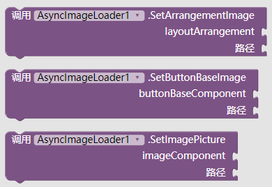
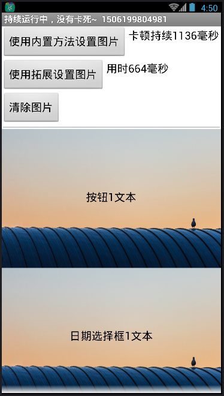
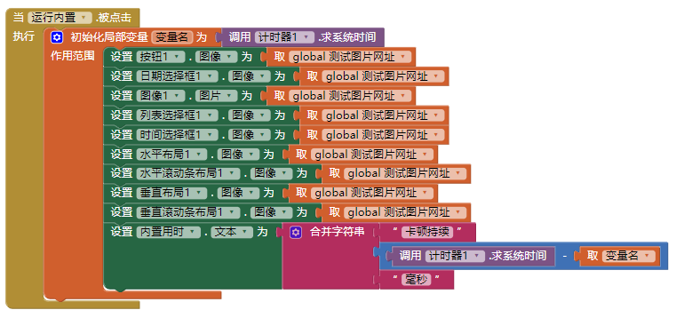
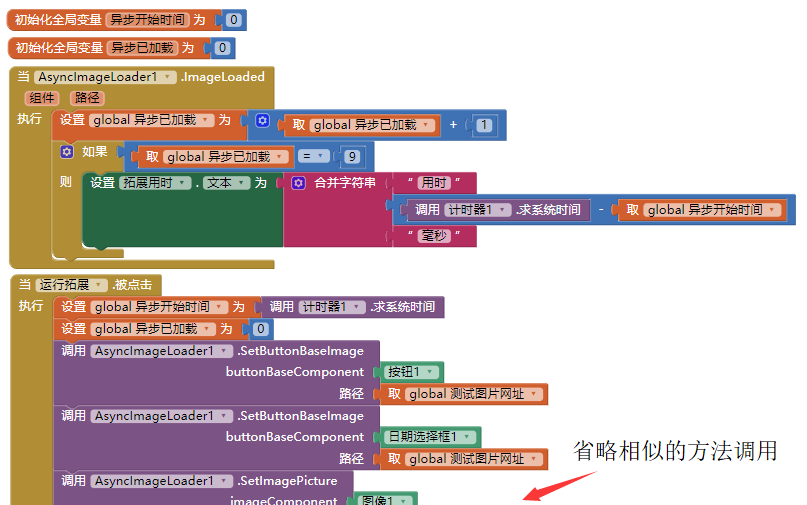

# 异步图片加载器 - AsyncImageLoader

---

不再需要等待加载在线图片的卡顿！

## 事件

* 图片加载失败
  {"name":"ImageLoadFailed", "componentName":"AsyncImageLoader1", "param": ["component","path"]}
* 图片加载成功
  {"name":"ImageLoaded", "param": ["component","path"]}

## 方法

* 给布局设置图片（表格布局没有图片属性所以不支持）
  {"name":"SetArrangementImage", "param":["layoutArrangement","path"]}
* 给按钮类型组件设置图片（支持按钮、日期选择框、列表选择框、时间选择框）
  {"name":"SetButtonBaseImage", "param":["buttonBaseComponent","path"]}
* 给图片组件设置图片（仅支持图像组件）
  {"name":"SetImagePicture", "param":["imageComponent","path"]}

  （共计支持9个带有图片选项的组件）
  注：这三个方法设置过的图片路径，不能通过组件本身的图片属性“倒过来”获取。  
  比方说，通过 SetImagePicture给一个没有图片的 **图像组件** 设置了一张网络图片素材之后，再调用该图片组件的“图片”属性，得到的值依旧是空的。

  

## 下载地址

* 最后更新 2017.9.24
* <a href="/aix/cn.colintree.aix.AsyncImageLoader.aix" target="_blank">下载1(本站)</a>

## 样例

* [样例aia](https://github.com/ColinTree/aix_colintree_cn/releases/download/AsyncImageLoaderTest/AsyncImageLoaderTest_zh.aia)   
* [样例apk](https://github.com/ColinTree/aix_colintree_cn/releases/download/AsyncImageLoaderTest/AsyncImageLoaderTest_zh.apk)  

实际运行中，同个网络环境下的运行结果差距很大。  

* 使用内置的组件属性直接设置网络图片，整个页面会停止运行，直到所有图片加载完毕（如图中停顿了1.1秒多）  
  
* 使用拓展的方法从开始调用，到图片陆陆续续加载出来，只经过了0.6秒，还不会影响屏幕的正常显示  
  