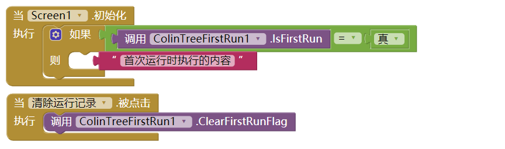

# 判断首次运行 - ColinTreeFirstRun \*

---

判断是否第一次运行，只需要一键调用即可完成！

## 方法

* 清除首次运行标记 - 调用这个方法后，下一次的`IsFirstRun`将会返回`真`(`true`)
  {"name":"ClearFirstRunFlag", "componentName":"ColinTreeFirstRun1"}
* 是否第一次运行 - 第一次调用返回`真`(`true`)，并自动记录一个标记，下一次调用将返回`假`(`false`)
  {"name":"IsFirstRun", "output":true}

## 使用方法

## 下载地址

* 最后更新 2017.8.17
* <a href="/aix/cn.colintree.aix.ColinTreeFirstRun.aix" target="_blank">下载1(本站)</a>
* [下载2](https://raw.githubusercontent.com/OpenSourceAIX/ColinTreeFirstRun/master/cn.colintree.aix.ColinTreeFirstRun.aix)
* [源代码](https://github.com/OpenSourceAIX/ColinTreeFirstRun)