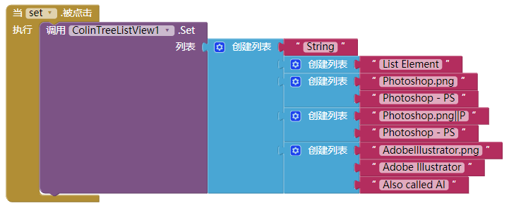
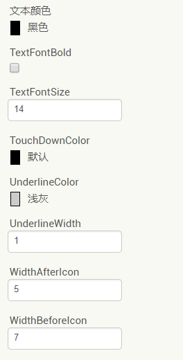
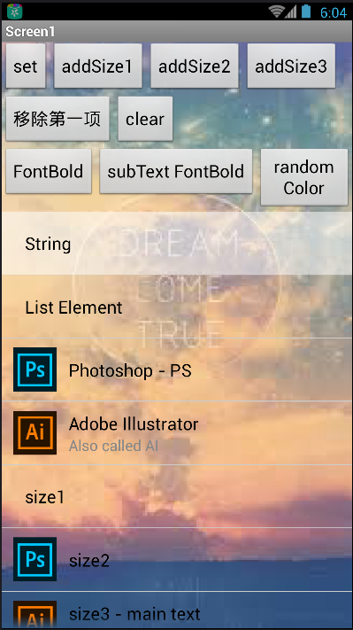
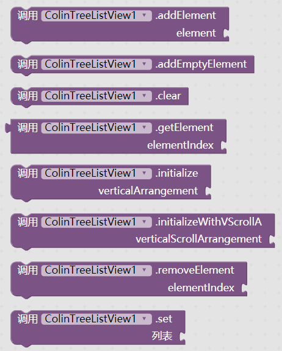
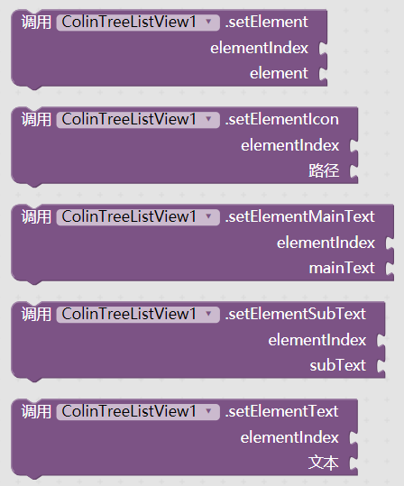

# 自定义列表显示 - ColinTreeListView

---

更高级的“列表显示框”，通过拓展组件动态实现！

### 基本使用流程

1. 为该组件预留一个空的 垂直布局 或 垂直滚动布局，将宽高设置好  
   如图：  
   

2. 在添加列表项之前先初始化一下，调用传入一个参数：  
   图中两种方法选其中一个即可  
   

3. 设置列表的内容：  
   其中，列表（list）这个参数是一个二维的列表（大列表套小列表），列表项可以为：

  * **无图标单文本列表项**：  
    直接一个文本作为列表项，则为列表显示项的文本
  * **无图标单文本列表项**（效果同上一个）：  
    一个列表，只有一个列表项，则这个列表项（文本）即为列表显示项的文本。显示效果与上一种相同
  * **带图标单文本列表项**：  
    一个列表有两个项，则依次对应：列表项图标路径 和 列表项文字
  * **带图标双文本列表项**：  
    一个列表有三个项，则依次对应：列表项图标路径、列表项主文字 和 列表项副文字

    **各种列表项可以在一个列表中共存，并按照各自的规则显示**

  代码样例如图：  
    
  对应显示效果：  
  

### 组件属性

ColinTreeListView提供了可以供实时更改的列表效果  
其中可供修改的属性有（这些属性的顺序不受代码控制，略微凌乱）：  

* 单个列表项的高度 - ElementHeight
* 列表图标的高 & 宽 - IconHeight & IconWidth
* 副文本的颜色 & 加粗 & 字体大小 - SubTextColor & SubTextBold & SubTextSize  
  
* 文本（包括主文本）的颜色 & 加粗 & 字体大小 - TextColor & TextBold & TextSize
* 列表项被按下时的颜色（默认为白色，透明度136/255，即53%） - TouchDownColor
* 列表项分割线（下划线）的颜色 & 线宽 - UnderlineColor & UnderlineWidth
* 列表项图标右 & 左的间距 - WidthAfterIcon & WidthBeforeIcon  
  

** 附列表项被按下时的颜色： **  

### 所有事件和方法

* 列表项事件：
  * 列表项被点击 - ElementClick
  * 列表项被长按 - ElementLongClick
  * 列表项被按下 - ElementTouchDown
  * 列表项被松开 - ElementTouchUp

  

* 列表图标事件（列表左边图标）：
  * 图标被点击 - IconClick
  * 图标被长按 - IconLongClick
  * 图标被按下 - IconTouchDown
  * 图标被松开 - IconTouchUp
  
  

* 列表处理：
  * 添加列表项 - addElement
  * 添加空列表项 - addEmptyElement
  * 清空列表 - clear
  * 获取列表项的内容(返回列表) - getElement
  * 初始化 - initialize
  * 初始化(使用滚动布局) - initializeWithVScrollA
  * 移除列表项 - removeElement
  * 设置列表内容 - set
  * ** 参数解释： **
    * element - 列表项内容
    * elementIndex - 列表项编号，从1开始算

  

* 单个列表项控制：
  * 设置单个列表项 - setElement
  * 设置单个列表项的图标 - setElementIcon
  * 设置单个列表项的主文本 - setElementMainText
  * 设置单个列表项的副文本 - setElementSubText
  * 设置单个列表项的文本 - setElementText
  * ** 参数解释： **
    * element - 列表项内容
    * elementIndex - 列表项编号，从1开始算

  

### {{ book.lang.Download }}  
  暂不放出，敬请谅解