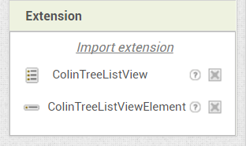
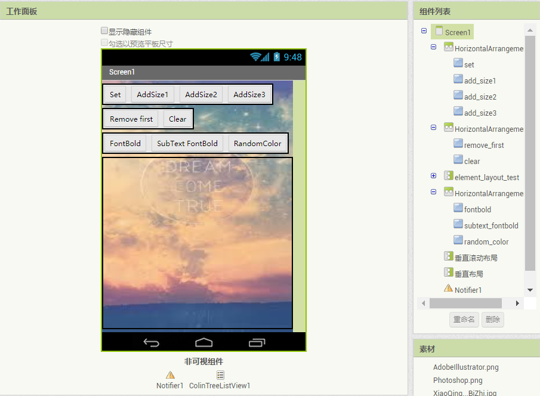

# 自定义列表显示 - ColinTreeListView *

---

更高级的“列表显示框”，通过拓展组件动态实现！

* 2019.6.5更新 (V11)：
  * 添加了组件内翻译（需要平台支持）
  * 修复了一个Get获取所有列表项的问题 **感谢[@10MINT](https://github.com/10MINT)的代码**
  * 添加了ColinTreeListViewElement中的ExtraButtonImage **部分代码由[@mkakozbeklem](https://github.com/mkakozbeklem)完成**
  * 取消了有些代码块被弃用的设定

* 2018.7.27更新（V10）：
  * 新增了Get获取所有列表项 **感谢[@10MINT](https://github.com/10MINT) 的PR**
  * 新增了LastLongClickedElement 最后被长按的列表项的编号 **感谢[@10MINT](https://github.com/10MINT) 的PR**
  * 修复了部分平台上部分列表项无法被点击的问题

* 2018.3.10更新（V9）：
  * 修复了显示Visible属性有关的错误
  * 新增了ClearCache(path)-清除缓存 & ClearAllCache()-清除所有缓存 的块 -- 虽说仍在测试中，但应可以达到效果的

* 2018.2.25更新（V8）：
  * 修复了ExtraButtonEnabled没作用的问题
  * 新增了ColinTreeListViewElement中直接设置列表项属性的方法

* 2018.2.25更新（V7） **感谢 [@User81](https://community.thunkable.com/u/User81) 的赞助**:
  * 修复了lastClickedElement从0开始算的问题
  * 修复了同路径缓存图被点击时就会触发的奇怪bug
  * 新增了个小图标
  * 新增了一个列表项处理组件 -> *[查看文档](#colintreelistviewelement)*  
    

* 2018.2.11更新（V6）：
  * 新增了两个文本高度属性

* 2018.1.31更新（V5）：
  * 新增了图标文字的相关属性
  * 新增了 最后被点击的列表项的编号(lastClickedElement) 和 最后被点击的图标的列表项编号(lastClickedIcon) 属性

* 2017.12.30更新（V4）：
  * 适配全平台（ai2.appinventor.mit.edu, thunkable, etc.) 应该彻底没有NoSuchMethod的问题了

* 2017.12.29更新（V3）：
  * 适配了2017.12.27新版本Appinventor（伴侣版本 2.45）（解决NoSuchMethod的问题）
  * 新增了图片相关的加载策略属性 - 异步加载图片（AsyncImageLoad） & 缓存同名文件（CacheImage）
  * 新增了自动滚动到底部的属性选项 - ScrollBottomAfterAdd

## 基本使用流程

1. 为该组件预留一个空的 垂直布局 或 垂直滚动布局，将宽高设置好  
  如图：  
  

2. 在添加列表项之前先初始化一下，调用传入一个参数：  
  图中两种方法选其中一个即可  
  

3. 设置列表的内容：  
  其中，列表（list）这个参数是一个二维的列表（大列表套小列表），列表项可以为：

  * **无图标单文本列表项**：  
    直接一个文本作为列表项，则为列表显示项的文本
  * **无图标单文本列表项**（效果同上一个）：  
    一个列表，只有一个列表项，则这个列表项（文本）即为列表显示项的文本。显示效果与上一种相同
  * **带图标单文本列表项**：  
    一个列表有两个项，则依次对应：列表项图标路径 和 列表项文字
  * **带图标双文本列表项**：  
    一个列表有三个项，则依次对应：列表项图标路径、列表项主文字 和 列表项副文字

  **各种列表项可以在一个列表中共存，并按照各自的规则显示**

  代码样例如图：  
    
  对应显示效果（列表项图标复合参数已勾选）：  
  

## 事件

* 列表项事件：
  * 列表项被点击
    {"name":"ElementClick", "param":["elementIndex"], "componentName":"ColinTreeListView1"}
    * *相关属性: 最后一次被点击的列表项（的编号）
      {"name":"LastClickedElement"}
  * 列表项被长按
    {"name":"ElementLongClick", "param":["elementIndex"]}
    * 相关属性: 最后一次被长按的列表项（的列表项编号）
      {"name":"LastLongClickedElement"}
  * 列表项被按下
    {"name":"ElementTouchDown", "param":["elementIndex"]}
  * 列表项被松开
    {"name":"ElementTouchUp", "param":["elementIndex"]}

* 小图标事件：
  * 图标被点击
    {"name":"ExtraButtonClick", "param":["elementIndex"]}
    * 相关属性: 最后一次被点击的小图标（的列表项编号）
      {"name":"LastClickedExtraButton"}
  * 图标被长按
    {"name":"ExtraButtonLongClick", "param":["elementIndex"]}
  * 图标被按下
    {"name":"ExtraButtonTouchDown", "param":["elementIndex"]}
  * 图标被松开
    {"name":"ExtraButtonTouchUp", "param":["elementIndex"]}

* 列表图标事件（列表左边图标）：
  * 图标被点击
    {"name":"IconClick", "param":["elementIndex"]}
    * *相关属性: 最后一次被点击的图标（的列表项编号）
      {"name":"LastClickedIcon"}
  * 图标被长按
    {"name":"IconLongClick", "param":["elementIndex"]}
  * 图标被按下
    {"name":"IconTouchDown", "param":["elementIndex"]}
  * 图标被松开
    {"name":"IconTouchUp", "param":["elementIndex"]}

## 方法

* 列表处理：
  * 添加列表项
    {"name":"AddElement", "param":["element"]}
  * 添加空列表项
    {"name":"AddEmptyElement"}
  * 清空列表
    {"name":"Clear"}
  * 获取所有列表项的内容(返回列表)
    {"name":"Get", "output":true}
  * 获取列表项的内容(返回列表)
    {"name":"GetElement", "param":["elementIndex"], "output":true}
  * 初始化
    {"name":"Initialize", "param":["verticalArrangement"]}
  * 初始化(使用滚动布局)
    {"name":"Initialize_Scroll", "param":["verticalScrollArrangement"]}
  * 移除列表项
    {"name":"RemoveElement", "param":["elementIndex"]}
  * 设置列表内容
    {"name":"Set", "param":["list"]}
  * ** 参数解释： **
    * element - 列表项内容
    * elementIndex - 列表项编号，从1开始算

* 单个列表项控制：
  * 设置单个列表项
    {"name":"SetElement", "param":["elementIndex", "element"]}
  * 设置单个列表项的图标
    {"name":"SetElementIcon", "param":["elementIndex", "path"]}
  * 设置单个列表项的主文本
    {"name":"SetElementMainText", "param":["elementIndex", "mainText"]}
  * 设置单个列表项的副文本
    {"name":"SetElementSubText", "param":["elementIndex", "subText"]}
  * 设置单个列表项的文本
    {"name":"SetElementText", "param":["elementIndex", "text"]}
  * ** 参数解释： **
    * element - 列表项内容
    * elementIndex - 列表项编号，从1开始算

* 其他操作
  * 清除所有图片缓存
    {"name":"ClearAllCache"}
  * 清除单张图片缓存
    {"name":"ClearCache", "param":["path"]}

## 组件属性

ColinTreeListView提供了可以供实时更改的列表效果  
其中可供修改的属性有（这些属性的顺序不受代码控制，略微凌乱）：  

* 异步加载图片
  {"name":"AsyncImageLoad"}
  {"name":"AsyncImageLoad", "getter":false}
* 缓存同名文件
  {"name":"CacheImage"}
  {"name":"CacheImage", "getter":false}
* 单个列表项的高度 - ElementHeight
  {"name":"ElementHeight"}
  {"name":"ElementHeight", "getter":false}
* 小图标背景颜色
  {"name":"ExtraButtonBgColor"}
  {"name":"ExtraButtonBgColor", "getter":false}
* 小图标是否启用 - 默认是不勾选的，如果要启用小图标请勾选此项
  {"name":"ExtraButtonEnabled"}
  {"name":"ExtraButtonEnabled", "getter":false}
* 小图标高度
  {"name":"ExtraButtonHeight"}
  {"name":"ExtraButtonHeight", "getter":false}
* 小图标图像
  {"name":"ExtraButtonImage"}
  {"name":"ExtraButtonImage", "getter":false}
* 小图标内边距
  {"name":"ExtraButtonPaddings"}
  {"name":"ExtraButtonPaddings", "getter":false}
* 小图标形状 - 同按钮的形状属性
  {"name":"ExtraButtonShape"}
  {"name":"ExtraButtonShape", "getter":false}
* 小图标文本 - 本拓展将不支持给每个列表项设置不同的小图标文本 :P
  {"name":"ExtraButtonText"}
  {"name":"ExtraButtonText", "getter":false}
* 小图标字体加粗
  {"name":"ExtraButtonTextFontBold"}
  {"name":"ExtraButtonTextFontBold", "getter":false}
* 小图标字体大小
  {"name":"ExtraButtonTextFontSize"}
  {"name":"ExtraButtonTextFontSize", "getter":false}
* 小图标宽度 
  {"name":"ExtraButtonWidth"}
  {"name":"ExtraButtonWidth", "getter":false}
* 列表项图标背景色
  {"name":"IconBgColor"}
  {"name":"IconBgColor", "getter":false}
* 列表项图标高度
  {"name":"IconHeight"}
  {"name":"IconHeight", "getter":false}
* 列表项图标使用复合参数
  * 如果选中这一项，一种新的格式（第5版新增）`图片路径||图标文本` 将会启用。例如 `Photoshop.png||P` 代表着一个图标的图片是 `Photoshop.png` 且上面还写这个 `P`
  {"name":"IconMultiParams"}
  {"name":"IconMultiParams", "getter":false}
* 列表项图标内边距 - 以确保图标文字能够更优地显示
  {"name":"IconPaddings"}
  {"name":"IconPaddings", "getter":false}
* 列表项图标形状 - 同按钮的形状属性
  {"name":"IconShape"}
  {"name":"IconShape", "getter":false}
* 列表项图标字体颜色
  {"name":"IconTextColor"}
  {"name":"IconTextColor", "getter":false}
* 列表项图标字体加粗
  {"name":"IconTextFontBold"}
  {"name":"IconTextFontBold", "getter":false}
* 列表项图标字体大小
  {"name":"IconTextFontSize"}
  {"name":"IconTextFontSize", "getter":false}
* 列表项图标宽度 - IconWidth
  {"name":"IconWidth"}
  {"name":"IconWidth", "getter":false}
* 添加新的列表项后，滚动到列表最底部（使用了微小的延时以保证列表已经重新渲染）
  {"name":"ScrollBottomAfterAdd"}
  {"name":"ScrollBottomAfterAdd", "getter":false}
* 副文本的字体颜色
  {"name":"SubTextColor"}
  {"name":"SubTextColor", "getter":false}
* 副文本字体加粗
  {"name":"SubTextFontBold"}
  {"name":"SubTextFontBold", "getter":false}
* 副文本字体大小
  {"name":"SubTextFontSize"}
  {"name":"SubTextFontSize", "getter":false}
* 副文本高度（-1为自适应，-2为填满）
  {"name":"SubTextHeight"}
  {"name":"SubTextHeight", "getter":false}
* 文本的字体颜色
  {"name":"TextColor"}
  {"name":"TextColor", "getter":false}
* 文本字体加粗
  {"name":"TextFontBold"}
  {"name":"TextFontBold", "getter":false}
* 文本字体大小
  {"name":"TextFontSize"}
  {"name":"TextFontSize", "getter":false}
* 文本高度（-1为自适应，-2为填满）
  {"name":"TextHeight"}
  {"name":"TextHeight", "getter":false}
* 列表项被按下时的颜 - 默认为白色，透明度136/255，即53%
  {"name":"TouchDownColor"}
  {"name":"TouchDownColor", "getter":false}
* 列表项分割线的颜色
  {"name":"UnderlineColor"}
  {"name":"UnderlineColor", "getter":false}
* 列表项分割线的线宽
  {"name":"UnderlineWidth"}
  {"name":"UnderlineWidth", "getter":false}
* 列表项图标右侧的间距
  {"name":"WidthAfterIcon"}
  {"name":"WidthAfterIcon", "getter":false}
* 列表项图标左侧的间距
  {"name":"WidthBeforeIcon"}
  {"name":"WidthBeforeIcon", "getter":false}

** 附列表项被按下时的颜色： **  

## ColinTreeListViewElement

这是一个用过来处理列表中的任意一个列表项的

**注意：在使用任何其他属性之前，请先使用`LinkToElement`来链接到一个列表项**  

以下是ColinTreeListView中没有的选项：

* 跟随列表设置 - 默认是假(False)，如果您希望这个列表项在列表的相关属性改变时不被修改，请设为真(True)
  {"name":"UseGlobalProperties", "componentName":"ColinTreeListViewElement1"}
  {"name":"UseGlobalProperties", "getter":false}
* 列表项背景色
  {"name":"ElementBackgroundColor"}
  {"name":"ElementBackgroundColor", "getter":false}

## 下载地址

* 最后更新 2019.6.5 (v11)
* <a href="/aix/cn.colintree.aix.ColinTreeListView.aix" target="_blank">直接下载</a>
* [更新信息](https://github.com/OpenSourceAIX/ColinTreeListView/releases/tag/v11)
* [自动构建文件 binary.zip](https://github.com/OpenSourceAIX/ColinTreeListView/releases/download/v11/binary.zip)
* [源码](https://github.com/OpenSourceAIX/ColinTreeListView)

## [需要更多的功能？](ListViewCustomize.md)