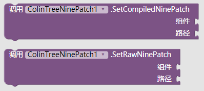
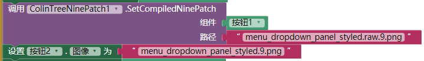
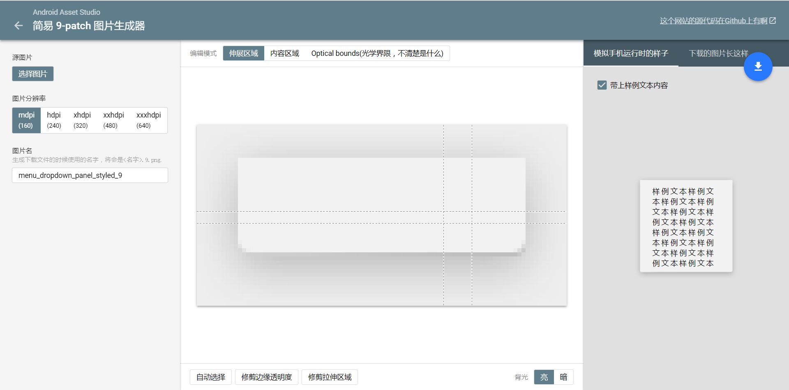

# 9-patch位图显示器 - ColinTreeNinePatch

---

<small>部分解释引用自[Android 的 9-patch 图片是什么？ - 知乎](https://www.zhihu.com/question/22297482)</small>

在以往，使用Appinventor 或 Thunkable 的过程中，大家经常会遇到一个问题：显示图片时，拉伸导致的变形以及模糊化  

在原生安卓中固然会有这种问题，但是谷歌的工程师们怎么可能忍受得了这么严峻的审美挑战呢  
于是，9-patch诞生了。

简单的说，9 patch 格式可以描述出一张图片哪些地方是可以拉伸的。  
举个例子，你看到QQ气泡框，无论你发多长的文字，图片中间都被填充，四周图片按原比例显示，这样就解决了不同长度图片可能被拉伸的问题。  

现在，通过[NinePatchChunk](https://github.com/Anatolii/NinePatchChunk)库（作者Anatolii发布于Github） 和 ColinTree的整合，NinePatch技术在Appinventor 和 Thunkable中可以轻松实现。

### 所有方法

* 将已经编译过的9patch设为组件的背景图 - SetCompiledNinePatch
* 将未编译过的9patch设为组件的背景图 - SetRawNinePatch
* **参数解释：**
  * component - 组件  
    例如：  
    通常是每一个组件的最下面一个代码块
  * path - 图片路径，和ai其他部分的路径规则相同  
    例如：  
    sample.9.png - 上传文件目录下的sample.9.png文件

### 下载地址

* 最后更新 2017.8.31
* <a href="/aix/cn.colintree.aix.ColinTreeNinePatch.aix" target="_blank">下载1(本站)</a>

### 样例

* [样例aia](https://github.com/ColinTree/aix_colintree_cn/releases/download/ColinTreeNinePatchTest/ColinTreeNinePatch_zh.aia)  
  <a href="http://app.gzjkw.net/?repo=aix.colintree.cn/templates/ColinTreeNinePatchTestzh/ColinTreeNinePatchTestzh.asc" target="_blank">使用广州电教馆服务器打开</a>  
* [样例apk](https://github.com/ColinTree/aix_colintree_cn/releases/download/ColinTreeNinePatchTest/ColinTreeNinePatch_zh.apk)  

现有一张已经编译过的素材menu_dropdown_panel_styled.9.png  
如果使用ColinTreeNinepatch设置到按钮上，可以正常显示为9patch样式  
而如果使用按钮自带的设置按钮图片，则会放大并模糊化  
  

### 9-patch制作

这里有一个纯英文的[在线9-patch制作器](https://romannurik.github.io/AndroidAssetStudio/nine-patches.html)  
推荐：下载下来的压缩文件中，折中选择"res\drawable-xhdpi\"文件夹里的图片进行下一步操作即可

然后我把页面大概翻译了一下：  

### 9-patch编译器

为了方便编译，我从Android Studio中提取了必要的文件(aapt.exe)，并写了一个批处理脚本，用于Windows系统上的9-patch文件编译  

将压缩文件解压之后，把需要编译的.9.png文件（还带着黑线条的9-patch图片）用鼠标拖动到ColinTree_9patch_compiler.bat上  
等待编译完成，在OUTPUT文件夹中即可找到编译过后没有黑线的.9.png文件。  

已经编译过的文件会把黑线所表达的信息写入图片中，凭肉眼无法识别，但Android运行中可以读取得到。所以在编译过后不要对图片做任何的处理！
* 最后更新 2017.8.31
* <a href="/aix/ColinTree_9patch_compiler.zip" target="_blank">下载1(本站)</a>