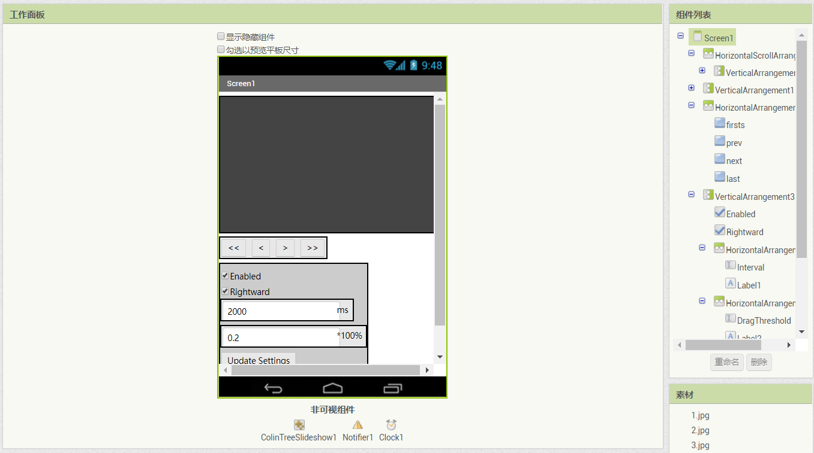

# 图片轮播 - ColinTreeSlideShow

---

图片轮播，一“件”搞定！

* 2017.9.24更新（v2）
  * 融合了新组件[AsyncImageLoader](AsyncImageLoader)，现在直接加载在线图片也不会卡啦
  * [GitHub Release](https://github.com/ColinTree/aix_colintree_cn/releases/tag/ColinTreeSlideShow_v2)

* 2017.9.17发布第一版本
  * [GitHub Release](https://github.com/ColinTree/aix_colintree_cn/releases/tag/ColinTreeSlideShow)

## 基本使用流程

1. 为该组件预留一个空的 水平滚动布局，将宽高设置好  
   （目前组件有个问题，在加入图片之后调整这个布局，图片不会跟随改变大小）  

   如图（背景颜色可以先设置好）：  
   

2. 在添加列表项之前先初始化一下，调用传入一个参数：
  {"name":"RegisterScrollView", "param":["horizontalScrollArrangement"], "componentName":"ColinTreeSlideShow1"}

3. 给轮播添加图片：
  {"name":"AddPhoto", "param":["path"]}

## 事件

* 自动轮播开始滚动
  {"name":"AutoSwipe"}
* 自动轮播滚动结束
  {"name":"AutoSwiped"}
* 图片被点击
  {"name":"SlideClick", "param":["slideIndex"]}
* 轮播开始滚动
  {"name":"Swipe"}
* 轮播滚动结束
  {"name":"Swiped"}
* 图片加载完毕 - ImageLoaded (v2新增)
  {"name":"ImageLoaded"}
* 图片加载失败 - ImageLoadFailed (v2新增)
  {"name":"ImageLoadFailed"}

## 方法

* 添加（追加）图片
  {"name":"AddPhoto", "param":["path"]}
* 正在播放第一张图片
  {"name":"AtFirstSlide", "output":true}
* 正在播放最后一张图片
  {"name":"AtLastSlide", "output":true}
* 更换图片
  {"name":"ChangePhoto", "param":["slideIndex","path"]}
* 前往第一张图
  {"name":"GoFirstSlide"}
* 前往最后一张图
  {"name":"GoLastSlide"}
* 前往下一张图
  {"name":"GoNextSlide"}
* 前往上一张图
  {"name":"GoPrevSlide"}
* 绑定水平滚动布局（初始化）
  {"name":"RegisterScrollView", "param":["horizontalScrollArrangement"]}
* ** 参数解释： **
  * slideIndex - 轮播图编号，从1开始算
  * 路径(path) - 图片路径

## 属性

* 是否开启自动轮播
  {"name":"AutoScrollEnabled", "getter":true, "componentName":"ColinTreeSlideShow1"}
  {"name":"AutoScrollEnabled", "getter":false}
* 当前正在播放图片编号
  {"name":"CurrentSlide"}
  {"name":"CurrentSlide", "getter":false}
* 拖动阈值 - 这个值的取值范围是0~1，对应0%~100%，默认值是0.2。当用户拖动轮播并松开，幅度达到阈值（布局宽度*阈值）时，轮播组件将自动跳向目标页。（**例子**：轮播所在的布局宽度为300像素，拖动阈值为0.2。当用户向右拖动了70个像素并松开时，由于70 > 300*0.2=60，轮播将自动跳向上一页。）
  {"name":"DragThreshold"}
  {"name":"DragThreshold", "getter":false}
* 自动轮播滚动方向向右（勾选此项轮播向右，取消勾选轮播向左）
  {"name":"ScrollRightward"}
  {"name":"ScrollRightward", "getter":false}
* 计时间隔（由于和计时器组件的属性使用同个名称，这里一般会直接有中文翻译。单位是毫秒，即1/1000秒） - 控制轮播自动播放的时间间隔
  {"name":"TimerInterval"}
  {"name":"TimerInterval", "getter":false}

* 加载时显示底图 - ImageWhileLoading (v2新增) - 不会显示在代码块属性列表中

## 下载地址

* 最后更新 2017.9.24 (v2)
* <a href="/aix/cn.colintree.aix.ColinTreeSlideshow.aix" target="_blank">下载1(本站)</a>
* [样例aia](https://github.com/ColinTree/aix_colintree_cn/releases/download/ColinTreeSlideShow_v2/ColinTreeSlideshowTest.aia)  
* [样例apk](https://github.com/ColinTree/aix_colintree_cn/releases/download/ColinTreeSlideShow_v2/ColinTreeSlideshowTest_appinventor.apk) - Appinventor  
* [样例apk](https://github.com/ColinTree/aix_colintree_cn/releases/download/ColinTreeSlideShow_v2/ColinTreeSlideshowTest_thunkable.apk) - Thunkable