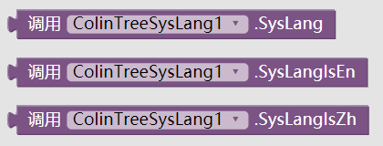
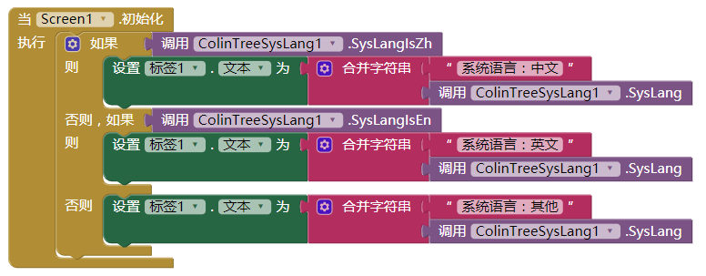
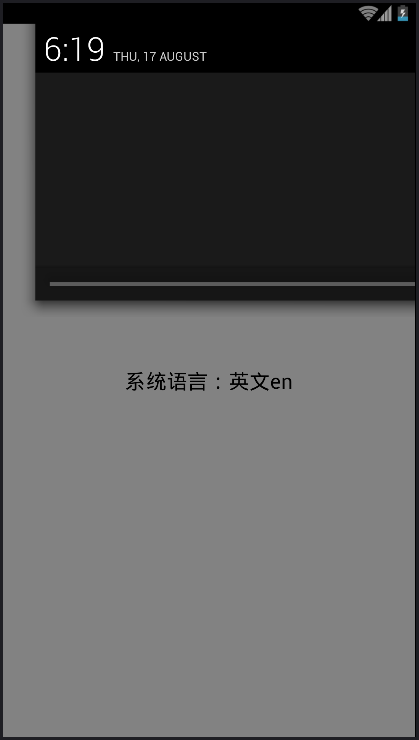

# 获取系统语言 - ColinTreeSysLang *

---

内置了三个过程：
* 获取系统语言
* 判断是否英文
* 判断是否中文

### 样例
设计了如图的代码  

分别在中英文系统下的显示（通知栏日期作为语言参照）：
 

### {{ book.lang.Download }}
* {{ book.lang.LastUpdate }} 2017.8.17
* <a href="/aix/cn.colintree.aix.ColinTreeSysLang.aix" target="_blank">{{ book.lang.Mirror1 }}</a>
* [{{ book.lang.Mirror2 }}](https://raw.githubusercontent.com/OpenSourceAIX/ColinTreeSysLang/master/cn.colintree.aix.ColinTreeSysLang.aix)
* [{{ book.lang.Source }}](https://github.com/OpenSourceAIX/ColinTreeSysLang)
