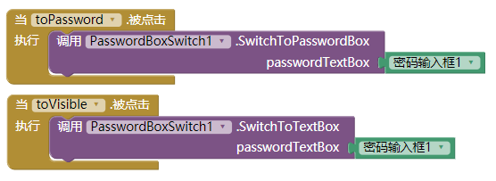
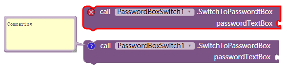

# 密码框文字可见度 - PasswordBoxSwitch

---

追随设计潮流，避免两个密码框~
（当今很多注册页面的设计中都会选择只使用一个密码框，并加一个用户可操作的密码可见度开关，减少用户的输入时间成本）

## 方法

* 切换至密码框状态
  {"name":"SwitchToPasswordBox", "param":["passwordTextBox"], "componentName":"PasswordBoxSwitch1"}
* 切换至文本框状态
  {"name":"SwitchToTextBox", "param":["passwordTextBox"]}

## 样例

就这么简单：  

> 2017.9.27 21:55左右我更新了拓展文件  
> 如果将这之前的旧拓展覆盖成新的，会导致原有代码块变成下图中，上面那个代码块那样。只需手动替换即可  
> 

## 下载地址

* 最后更新 2017.9.27
* <a href="/aix/cn.colintree.aix.PasswordBoxSwitch.aix" target="_blank">下载1(本站)</a>
