# 滚动布局管理器 - ScrollArrangementHandlers (v2+)

---

这个拓展包内包含了两个拓展，水平滚动布局管理器HorizontalScrollHandler，和垂直滚动管理器VerticalScrollHandler

2017.9.29更新：
* 修复了大部分方法的命名问题（并重命名组件以避免错误）
* 加了个组件图标
* 增加了“显示渐变边缘”属性 - FadingEdgeEnabled
* 增加了“过度滚动动画样式”属性 - OverScrollMode
* 增加了“显示滚动条”属性 - ScrollBarEnabled
* 增加了“允许用户操作滚动布局”属性 - UserControl
* 增加了“最大滚动位置”属性 - MaxScrollPosition
* 增加了“滚动位置”属性 - ScrollPosition

2017.8.26更新：
* 增加了布局被松开事件 - TouchUp

## 水平滚动布局管理器 HorizontalScrollHandler

* 事件：
  * 布局滚动到最左端 - ReachLeftEnd
  * 布局滚动到最右端 - ReachRightEnd
  * 布局发生滚动 - ScrollChanged
  * 布局被松开 - TouchUp

  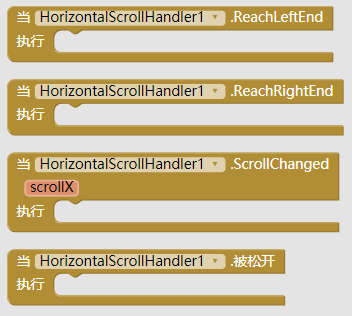

* 方法：
  * 向左半页滚动 - ArrowScrollLeftward
  * 向右半页滚动 - ArrowScrollRightward
  * 向左整页滚动 - PageScrollLeftward
  * 向右整页滚动 - PageScrollRightward
  * 绑定水平滚动布局 - RegisterScrollView
  * 滚动一段距离 - ScrollBy
  * 滚动到最左 - ScrollLeftEnd
  * 滚动到最右 - ScrollRightEnd
  * 滚动到指定位置 - ScrollTo
  * 平滑的滚动一段距离 - SmoothScrollBy
  * 平滑的滚动到指定位置 - SmoothScrollTo
  * ** 参数解释： **
    * px - 滚动的距离。向右为正，向左为负

  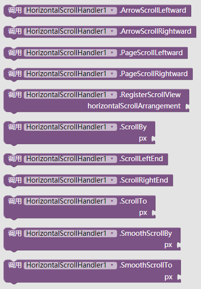

* 属性：
  * 显示渐变边缘 - FadingEdgeEnabled  

    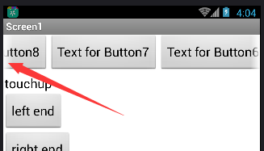

  * 过度滚动动画样式 - OverScrollMode
    * 0 - 总是允许过度滚动
    * 1（默认） - 当布局可以被有效滚动时才允许过度滚动
    * 2 - 禁止过度滚动
    * **（在不同版本的系统中过度滚动动画看起来可能会不太一样**  
    
    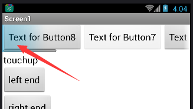

  * 显示滚动条 - ScrollBarEnabled

    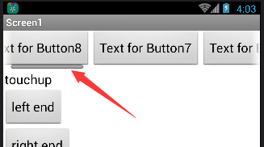

  * 允许用户操作滚动布局 - UserControl

  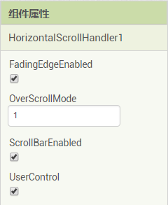  

  * 最大滚动位置 - MaxScrollPosition
  * 滚动位置 - ScrollPosition
  
  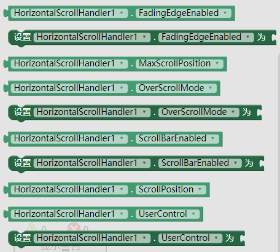

## 垂直滚动布局管理器 VerticalScrollHandler

* 事件：
  * 布局滚动到最底端 - ReachBottom
  * 布局滚动到最顶端 - ReachTop
  * 布局发生滚动 - ScrollChanged
  * 布局被松开 - TouchUp

  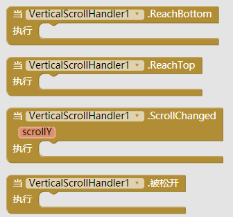

* 方法：
  * 向上进行半页滚动 - ArrowScrollUpward
  * 向右进行半页滚动 - ArrowScrollDownward
  * 向上进行整页滚动 - PageScrollUpward
  * 向下进行整页滚动 - PageScrollDownward
  * 绑定垂直滚动布局 - RegisterScrollView
  * 滚动到最低端 - ScrollBottom
  * 滚动一段距离 - ScrollBy
  * 滚动到指定位置 - ScrollTo
  * 滚动到最顶端 - ScrollTop
  * 平滑的滚动一段距离 - SmoothScrollBy
  * 平滑的滚动到指定位置 - SmoothScrollTo
  * ** 参数解释： **
    * px - 滚动的距离。向下为正，向上为负

  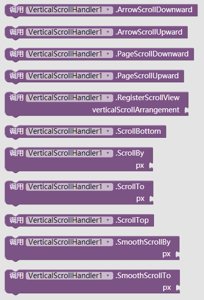

* 属性：
  * 显示渐变边缘 - FadingEdgeEnabled  

    

  * 过度滚动动画样式 - OverScrollMode
    * 0 - 总是允许过度滚动
    * 1（默认） - 当布局可以被有效滚动时才允许过度滚动
    * 2 - 禁止过度滚动
    * **（在不同版本的系统中过度滚动动画看起来可能会不太一样）**  
    
    

  * 显示滚动条 - ScrollBarEnabled

    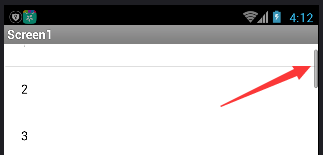

  * 允许用户操作滚动布局 - UserControl

  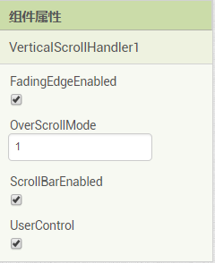  

  * 最大滚动位置 - MaxScrollPosition
  * 滚动位置 - ScrollPosition
  
  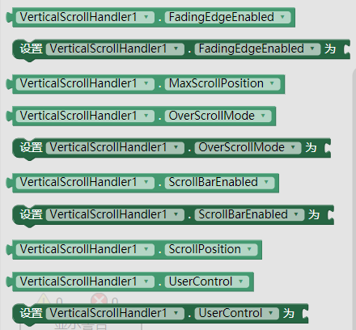

### 下载地址
* 最后更新 2017.8.26 (v2)
* <a href="/aix/cn.colintree.aix.ScrollArrangementHandlers.aix" target="_blank">下载1(本站)</a>